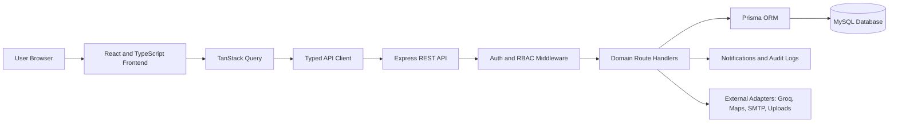
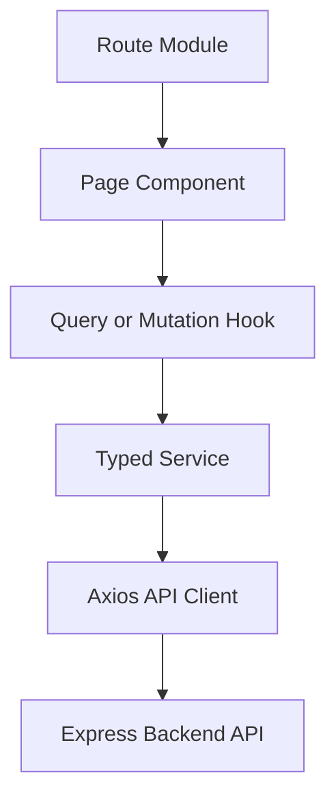
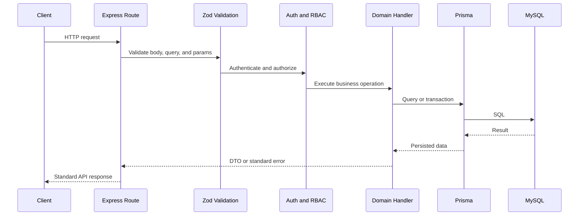
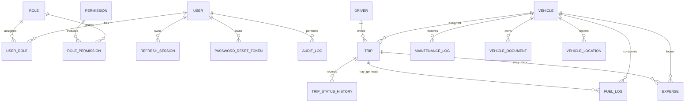
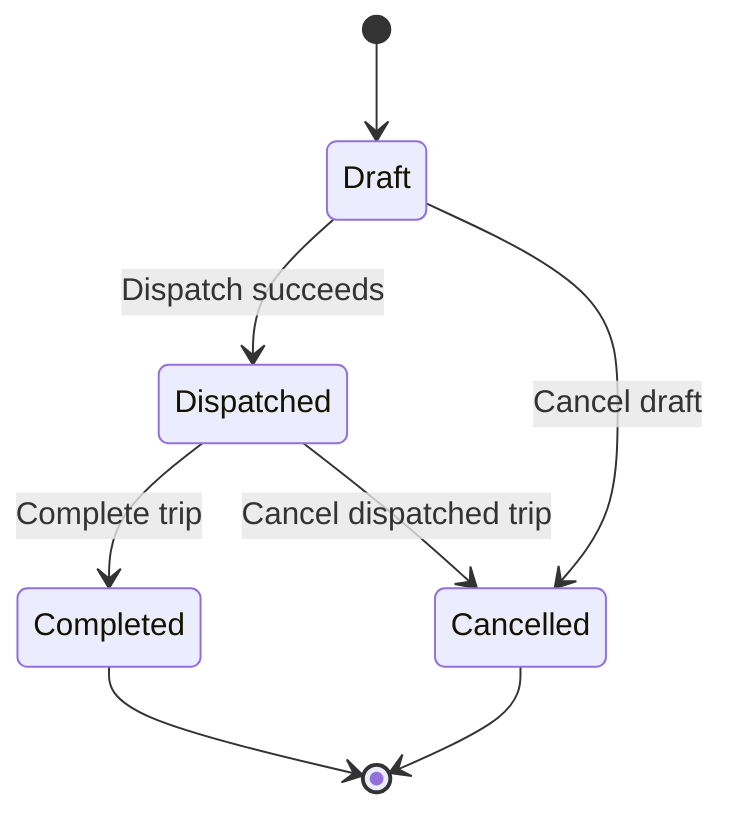
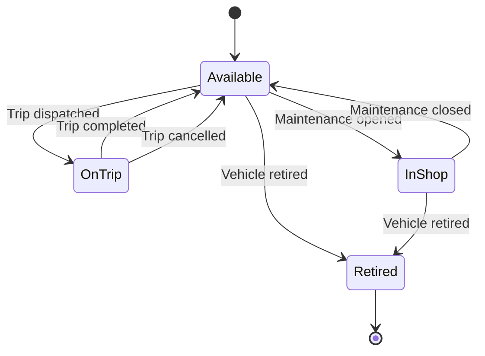
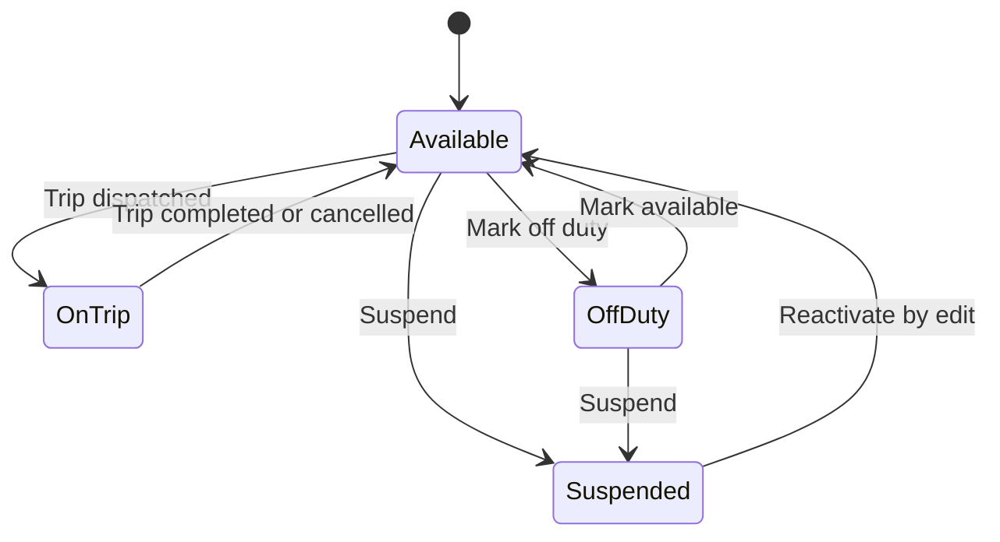
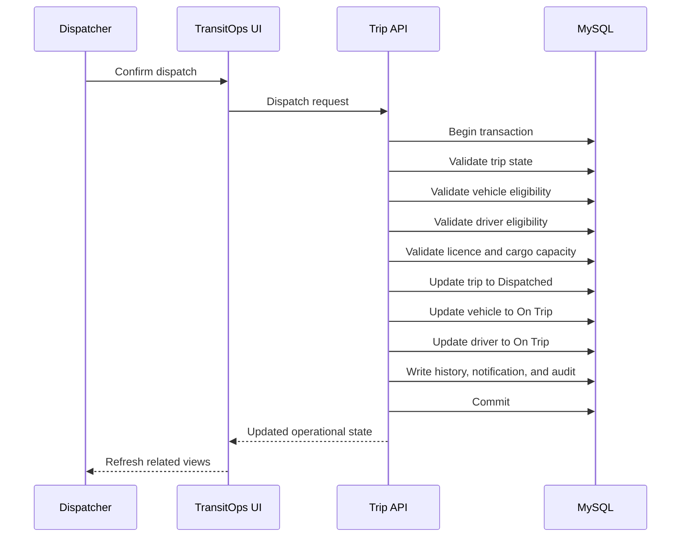
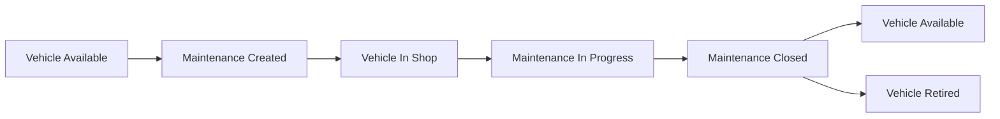
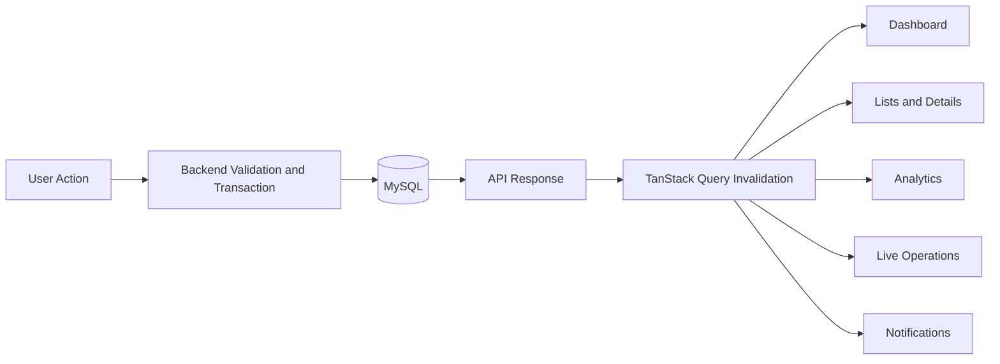

# TransitOps

**Smart Transport Operations Platform**

TransitOps is a centralized, database-backed transport ERP platform for managing vehicles, drivers, dispatch, maintenance, fuel, expenses, compliance, live operations, and analytics through secure and explainable workflows.


| Highlight | Implementation |
| --- | --- |
| Database-first ERP architecture | Prisma schema, MySQL relations, migrations, and seed data |
| Transaction-safe dispatch workflows | Trip dispatch, completion, cancellation, maintenance, and status updates use backend validation and database transactions |
| Role-based access control | Admin, Fleet Manager, Dispatcher, Safety Officer, and Financial Analyst permissions |
| Explainable dispatch recommendations | Eligibility checks and factor-based scoring before trip creation |
| Fleet health monitoring | Risk scoring from maintenance, mileage, fuel, age, and cost signals |
| Live operations command center | Map, active trips, exceptions, and operational timeline |
| Dynamic operational views | TanStack Query caching, invalidation, polling, and refetching |

## Table of Contents

- [Problem Statement](#problem-statement)
- [Solution Overview](#solution-overview)
- [Key Features](#key-features)
- [What Makes TransitOps Different](#what-makes-transitops-different)
- [Core Business Rules](#core-business-rules)
- [System Architecture](#system-architecture)
- [Frontend Architecture](#frontend-architecture)
- [Backend Architecture](#backend-architecture)
- [Database Design](#database-design)
- [Core Workflows](#core-workflows)
- [Dynamic Data Synchronization](#dynamic-data-synchronization)
- [Role-Based Access Control](#role-based-access-control)
- [Technology Stack](#technology-stack)
- [Project Structure](#project-structure)
- [API Overview](#api-overview)
- [Local Setup](#local-setup)
- [Environment Variables](#environment-variables)
- [Database Setup and Migrations](#database-setup-and-migrations)
- [Demo Accounts](#demo-accounts)
- [Suggested Demo Workflow](#suggested-demo-workflow)
- [Testing](#testing)
- [Security](#security)
- [Performance and Scalability](#performance-and-scalability)
- [Responsive Experience](#responsive-experience)
- [Future Roadmap](#future-roadmap)
- [Contributing](#contributing)
- [License](#license)
- [Hackathon Acknowledgement](#hackathon-acknowledgement)

## Problem Statement

Transport operations often rely on spreadsheets, logbooks, manual dispatch calls, and disconnected expense records. This makes it difficult to prevent duplicate assignments, identify expired driver licences, enforce cargo capacity, track maintenance, understand fuel cost, or audit operational decisions.

TransitOps addresses these gaps with one relational system for fleet, driver, trip, maintenance, compliance, cost, live operations, and analytics data.

## Solution Overview

TransitOps manages the complete transport operations lifecycle: authentication, vehicle registry, driver compliance, trip planning, dispatch, trip completion, cancellation, maintenance, fuel, expenses, dashboard KPIs, analytics, notifications, settings, documents, live operations, dispatch intelligence, and advisory AI operations summaries.

| Module | Purpose | Key Capabilities |
| --- | --- | --- |
| Authentication | Secure system access | Login, refresh tokens, logout, current-user lookup, password reset token flow |
| Dashboard | Operational snapshot | KPIs, recent trips, vehicle status, alerts, activity feed |
| Vehicle Registry | Fleet master data | Create, edit, retire, status tracking, documents, dispatch eligibility |
| Driver Management | Driver and licence control | Create, edit, suspend, safety score, licence expiry compliance |
| Trip Management | Dispatch lifecycle | Draft, dispatch, complete, cancel, edit draft trips, status history |
| Maintenance | Vehicle service lifecycle | Open maintenance, edit active records, close service, vehicle in-shop status |
| Fuel and Expenses | Cost tracking | Fuel logs, operational expenses, trip-linked costs, CSV export |
| Analytics | Cost and revenue insight | Summary, vehicle-level analytics, revenue, cost reports |
| Live Operations | Current operations view | Map, active trip markers, exceptions, timeline, drill-down panels |
| Notifications | Operational alerts | Read/unread notifications, read-all action, polling refresh |
| Settings | Administrative control | Users, roles, organization settings, integration status |
| Documents | Vehicle document handling | Upload, list, download, and delete vehicle documents |
| Dispatch Intelligence | Assignment advisory | Ranked vehicle-driver suggestions with transparent scoring |
| Fleet Health | Risk radar | Health score, risk reasons, recommendations, pagination and filters |
| Operations Copilot | Advisory layer | Database-context operational summaries through a backend AI endpoint |

## Key Features

- Vehicle and driver registries backed by MySQL records.
- Trip dispatch lifecycle with backend-enforced status transitions.
- Driver licence validation and dynamic safety score calculation.
- Maintenance workflows that move vehicles into and out of shop status.
- Fuel and expense tracking with vehicle/trip validation.
- Role-aware navigation and backend authorization.
- Live operations map using Leaflet and OpenStreetMap tiles.
- Dispatch recommendations with eligibility checks and explainable scores.
- Fleet health radar with risk factors and recommended actions.
- Notifications, analytics, CSV export, and settings.
- Responsive operational UI for desktop, tablet, and mobile layouts.

## What Makes TransitOps Different

### Explainable Dispatch Intelligence

Dispatch Intelligence checks eligibility before ranking assignments. It evaluates vehicle availability, driver availability, licence validity, cargo capacity, safety score, maintenance readiness, fuel efficiency, operating cost, and regional proximity.

Ineligible assignments are shown as blocked with reasons. Eligible combinations receive factor-based scores, but recommendations do not override backend rules; the Trip API revalidates dispatch at execution time.

### Fleet Health Risk Radar

Fleet Health derives vehicle risk from service due status, kilometres since service, repair frequency, maintenance cost, fuel efficiency trend, vehicle age, odometer readings, and active maintenance status. Each record includes a score, reasons, and recommended actions.

### Live Operations Command Center

Live Operations provides a status-aware operations view with active trips, Leaflet/OpenStreetMap map rendering, route previews, vehicle and trip drill-down, operational exceptions, and timeline events. It models operational visibility from database-backed records rather than claiming real GPS telemetry.

### Decision Audit Trail

The backend writes audit entries for major operations with actor, action, entity type, entity id, correlation id, IP address, user agent, timestamp, and optional metadata. Trip status history records operational status transitions and cancellation reasons.

### Contextual Operations Copilot

The Operations Copilot is an advisory layer over backend operational context. It can summarize current fleet, driver, trip, maintenance, and cost data, but it does not directly mutate operational records and cannot bypass mandatory backend validation.

## Core Business Rules

Critical rules are enforced on the backend with Zod validation, Prisma queries, and transactions. Frontend controls improve usability, but backend validation is authoritative.

| Rule | How TransitOps Enforces It |
| --- | --- |
| Vehicle registration numbers are unique | Prisma unique constraint and duplicate conflict handling |
| Retired vehicles cannot be dispatched | Dispatch eligibility rejects retired vehicle status |
| Vehicles in maintenance cannot be dispatched | Dispatch eligibility rejects in-shop vehicles |
| On-trip vehicles cannot be assigned again | Dispatch transaction updates vehicle status and checks availability |
| Drivers with expired licences cannot be assigned | Dispatch eligibility checks licence expiry against current date |
| Suspended drivers cannot be assigned | Dispatch eligibility rejects suspended status |
| Off-duty drivers cannot be assigned | Dispatch eligibility rejects off-duty status |
| On-trip drivers cannot be assigned again | Dispatch transaction checks driver availability |
| Cargo weight cannot exceed capacity | Dispatch eligibility compares cargo weight to vehicle capacity |
| Dispatch updates trip, vehicle, and driver status | Trip dispatch runs inside a Prisma transaction |
| Completing a trip restores vehicle and driver availability | Completion transaction updates trip, vehicle, driver, odometer, fuel, and expense data |
| Cancelling a dispatched trip restores resources | Cancellation transaction releases vehicle and driver |
| Maintenance moves vehicle to In Shop | Maintenance creation/update sets vehicle status for active records |
| Closing maintenance restores availability unless retired | Close transaction checks vehicle status and remaining active maintenance |
| Final odometer cannot be lower than starting odometer | Trip completion validates final odometer |
| Monetary and fuel values cannot be negative | Zod schemas enforce minimum values |
| Fuel and expense trip references must match selected vehicle | Fuel and expense APIs validate trip-to-vehicle consistency |
| Invalid lifecycle transitions are rejected | Trip and maintenance routes check current status before mutation |

## System Architecture



- **Presentation layer:** React routes, reusable UI components, responsive layouts, and role-aware navigation.
- **API client and state synchronization:** Axios service layer, TanStack Query cache keys, domain invalidation, and polling where required.
- **Backend middleware:** Helmet, CORS, request limits, cookies, authentication, RBAC, logging, and correlation IDs.
- **Domain handlers:** Express route handlers validate and execute business workflows.
- **Persistence layer:** Prisma ORM over MySQL with normalized tables, indexes, decimals, and relations.
- **Optional adapters:** Groq AI, OpenStreetMap-compatible map tiles, SMTP configuration, and local upload storage.

## Frontend Architecture

The frontend uses React, TypeScript, Vite, TanStack Router, TanStack Query, Axios, Tailwind CSS, Radix/shadcn-style UI primitives, Recharts, Leaflet, React Leaflet, React Hook Form, and Zod.



Frontend patterns include protected authenticated routes, role-aware sidebar navigation, typed domain services, centralized query keys, mutation invalidation helpers, reusable status badges, data tables, filters, pagination, loading/error/empty states, and responsive grids.

## Backend Architecture

The backend uses Node.js, Express, TypeScript, Prisma, MySQL, Zod, JWT access tokens, refresh sessions, HttpOnly refresh cookies, RBAC middleware, centralized error responses, audit logs, upload handling through Multer, rate limiting, Helmet security headers, CORS, and Pino HTTP logging.



## Database Design

TransitOps uses a relational MySQL model defined in `Backend/prisma/schema.prisma`. The schema normalizes master data, transactional records, security sessions, operational history, documents, notifications, vehicle locations, and audit logs.

Implemented entities:

- User, Role, Permission, UserRole, RolePermission
- Region, VehicleType, LicenceCategory, OrganizationSettings
- Vehicle, Driver, Trip, TripStatusHistory
- MaintenanceLog, FuelLog, Expense
- VehicleDocument, VehicleLocation
- Notification, AuditLog, RefreshSession, PasswordResetToken



Important schema constraints and data choices:

- Unique user email, vehicle registration number, driver licence number, trip number, maintenance number, expense number, refresh token hash, and reset token hash.
- Indexed operational fields such as vehicle status, driver status, licence expiry, trip status, planned departure, maintenance dates, expense date, fuel date, notification status, and vehicle location.
- Decimal fields for money, distance, litres, speed, and coordinates.
- Join tables for roles and permissions.
- Preserved trip status history and audit logs for traceability.

## Core Workflows

### Trip Lifecycle



### Vehicle Lifecycle



### Driver Lifecycle



### Dispatch Transaction



Any dispatch validation failure rejects the request before the final committed state is returned.

### Maintenance Workflow



## Dynamic Data Synchronization

TransitOps uses immediate post-mutation synchronization through TanStack Query invalidation, automatic refetching, and focused polling for notifications. It does not depend on WebSockets for current state.



Database commits happen before success feedback is shown. Related frontend domains are then invalidated and refreshed.

## Role-Based Access Control

| Role | Responsibilities |
| --- | --- |
| Admin | Full access to all modules, users, settings, deletes, and protected operations |
| Fleet Manager | Fleet, maintenance, operations visibility, and fleet health workflows |
| Dispatcher | Live operations, dispatch intelligence, trip operations, and fuel entry |
| Safety Officer | Driver compliance, safety profiles, and operational visibility |
| Financial Analyst | Fuel, expenses, analytics, and reporting views |

Frontend navigation is role-aware, but backend `requireRole` middleware is the authority for protected operations. Users cannot self-select roles from the application shell.

## Technology Stack

| Layer | Technology | Purpose |
| --- | --- | --- |
| Frontend | React 19, TypeScript, Vite | UI application |
| Routing | TanStack Router / TanStack Start | File-based route modules and SSR build |
| Server State | TanStack Query | Query caching, mutation state, invalidation |
| API Client | Axios | HTTP client, auth refresh, error normalization |
| Forms and Validation | React Hook Form, Zod | Form handling and schema validation |
| UI | Tailwind CSS, Radix UI primitives, lucide-react, sonner | Components, icons, toasts |
| Charts | Recharts | Dashboard and analytics charts |
| Maps | Leaflet, React Leaflet | Live operations and route visualization |
| Backend | Node.js, Express, TypeScript | REST API |
| ORM | Prisma | MySQL access and migrations |
| Database | MySQL | Operational persistence |
| Authentication | bcryptjs, jsonwebtoken, cookie-parser | Password hashing, access tokens, refresh cookies |
| Security | Helmet, CORS, express-rate-limit, Zod | Headers, origins, throttling, validation |
| File Uploads | Multer | Vehicle document uploads |
| Logging | pino-http | Request logging |
| Testing | Vitest, Supertest | Backend test tooling configured |

## Project Structure

```text
TransitOps/
|-- Backend/
|   |-- prisma/
|   |   |-- migrations/
|   |   |-- schema.prisma
|   |   `-- seed.ts
|   |-- src/
|   |   |-- config/
|   |   |-- app.ts
|   |   |-- auth.ts
|   |   |-- db.ts
|   |   |-- dto.ts
|   |   |-- errors.ts
|   |   `-- server.ts
|   |-- uploads/
|   `-- package.json
|-- Frontend/
|   |-- src/
|   |   |-- app/
|   |   |-- components/
|   |   |-- features/
|   |   |-- lib/
|   |   |-- routes/
|   |   |-- styles.css
|   |   `-- types/
|   `-- package.json
|-- LICENSE
`-- README.md
```

## API Overview

All API routes are served under `/api/v1`. Responses use a standard envelope:

```json
{
  "success": true,
  "data": {}
}
```

```json
{
  "success": false,
  "error": {
    "code": "ERROR_CODE",
    "message": "Human-readable message",
    "fields": {}
  }
}
```

| Method | Endpoint | Purpose | Access |
| --- | --- | --- | --- |
| GET | `/health` | Health check | Public |
| GET | `/ready` | Database readiness check | Public |
| POST | `/auth/login` | Login and issue tokens | Public |
| POST | `/auth/refresh` | Refresh access token | Refresh cookie |
| POST | `/auth/logout` | Revoke refresh session | Authenticated |
| GET | `/auth/me` | Current user | Authenticated |
| POST | `/auth/forgot-password` | Create reset token | Public |
| POST | `/auth/reset-password` | Reset password | Public |
| GET | `/users` | List users | Admin |
| POST | `/users` | Create user | Admin |
| PATCH | `/users/:id` | Update user | Admin |
| DELETE | `/users/:id` | Deactivate user | Admin |
| GET | `/settings` | Organization settings | Admin |
| PATCH | `/settings` | Update settings | Admin |
| GET | `/settings/integrations` | Integration configuration status | Admin |
| GET | `/vehicles` | List vehicles with filters and paging | Authenticated |
| POST | `/vehicles` | Create vehicle | Fleet Manager, Admin |
| GET | `/vehicles/:id` | Vehicle detail | Authenticated |
| PATCH | `/vehicles/:id` | Update vehicle | Fleet Manager, Admin |
| DELETE | `/vehicles/:id` | Retire vehicle | Fleet Manager, Admin |
| GET | `/vehicles/dispatch-eligible` | Available dispatch vehicles | Authenticated |
| GET | `/drivers` | List drivers with filters and paging | Authenticated |
| POST | `/drivers` | Create driver | Safety Officer, Fleet Manager, Admin |
| PATCH | `/drivers/:id` | Update driver | Safety Officer, Fleet Manager, Admin |
| DELETE | `/drivers/:id` | Suspend driver | Admin |
| GET | `/drivers/dispatch-eligible` | Available dispatch drivers | Authenticated |
| GET | `/trips` | List trips | Authenticated |
| POST | `/trips` | Create draft trip | Dispatcher, Admin |
| PATCH | `/trips/:id` | Edit draft trip | Dispatcher, Admin |
| POST | `/trips/:id/dispatch` | Dispatch trip | Dispatcher, Admin |
| POST | `/trips/:id/complete` | Complete trip | Dispatcher, Admin |
| POST | `/trips/:id/cancel` | Cancel trip | Dispatcher, Admin |
| DELETE | `/trips/:id` | Delete/cancel non-completed trip | Admin |
| GET | `/maintenance` | List maintenance | Authenticated |
| POST | `/maintenance` | Create maintenance | Fleet Manager, Admin |
| PATCH | `/maintenance/:id` | Edit maintenance | Fleet Manager, Admin |
| POST | `/maintenance/:id/close` | Close maintenance | Fleet Manager, Admin |
| DELETE | `/maintenance/:id` | Delete non-completed maintenance | Admin |
| GET | `/fuel-logs` | List fuel logs | Authenticated |
| POST | `/fuel-logs` | Create fuel log | Authenticated |
| PATCH | `/fuel-logs/:id` | Update fuel log | Authenticated |
| DELETE | `/fuel-logs/:id` | Delete fuel log | Admin |
| GET | `/expenses` | List expenses | Authenticated |
| POST | `/expenses` | Create expense | Authenticated |
| PATCH | `/expenses/:id` | Update expense | Authenticated |
| DELETE | `/expenses/:id` | Delete expense | Admin |
| GET | `/dashboard/kpis` | Dashboard metrics | Authenticated |
| GET | `/analytics/summary` | Analytics summary | Authenticated |
| GET | `/analytics/vehicles` | Vehicle analytics | Authenticated |
| GET | `/reports/export` | CSV report export | Authenticated |
| GET | `/notifications` | List notifications | Authenticated |
| PATCH | `/notifications/:id/read` | Mark notification read | Authenticated |
| PATCH | `/notifications/read-all` | Mark all notifications read | Authenticated |
| GET | `/vehicles/:vehicleId/documents` | List vehicle documents | Authenticated |
| POST | `/vehicles/:vehicleId/documents` | Upload document | Authenticated |
| GET | `/documents/:id/download` | Download document | Authenticated |
| DELETE | `/documents/:id` | Delete document | Authenticated |
| GET | `/locations/search` | Search map locations | Rate-limited |
| POST | `/routes/preview` | Preview route geometry | Authenticated |
| GET | `/vehicle-locations` | Vehicle location list | Authenticated |
| POST | `/ai/operations-summary` | Operations Copilot response | Authenticated |
| POST | `/ai/explain-dispatch-block` | Explain blocked dispatch | Authenticated |
| POST | `/ai/fleet-insights` | Fleet insights | Authenticated |
| POST | `/ai/maintenance-summary` | Maintenance summary | Authenticated |

## Local Setup

### Prerequisites

- Git
- Node.js 22.x or a recent LTS compatible with the installed packages
- npm
- MySQL 8.x

### Clone

```bash
git clone https://github.com/sanket913/odoo-hackathon-2026.git
cd odoo-hackathon-2026
```

### Backend

```bash
cd Backend
npm install
cp .env.example .env
npm run prisma:generate
npm run prisma:migrate
npm run seed
npm run dev
```

Windows PowerShell environment copy:

```powershell
Copy-Item .env.example .env
```

### Frontend

```bash
cd Frontend
npm install
cp .env.example .env
npm run dev
```

Windows PowerShell environment copy:

```powershell
Copy-Item .env.example .env
```

Default local URLs:

- Backend API: `http://localhost:5000/api/v1`
- Frontend: `http://localhost:5173`

## Environment Variables

### Backend

| Variable | Required | Description |
| --- | --- | --- |
| `NODE_ENV` | No | Runtime mode: `development`, `test`, or `production` |
| `PORT` | No | API server port |
| `DATABASE_URL` | Yes | MySQL connection string |
| `CLIENT_URL` | No | Frontend origin |
| `CORS_ORIGINS` | No | Comma-separated allowed origins |
| `JWT_ACCESS_SECRET` | Yes for production | Access-token signing secret |
| `JWT_REFRESH_SECRET` | Yes for production | Refresh-token signing secret |
| `JWT_ACCESS_EXPIRES_IN` | No | Access-token lifetime |
| `JWT_REFRESH_EXPIRES_IN` | No | Refresh-session lifetime |
| `COOKIE_SECURE` | No | Enables secure refresh cookies |
| `UPLOAD_DIR` | No | Local upload storage directory |
| `MAX_UPLOAD_SIZE_MB` | No | Upload size limit |
| `GROQ_API_KEY` | No | Enables Groq-backed Copilot responses |
| `GROQ_MODEL` | No | Groq model name |
| `SMTP_HOST` | No | SMTP host for future email delivery |
| `SMTP_PORT` | No | SMTP port |
| `SMTP_USER` | No | SMTP username |
| `SMTP_PASS` | No | SMTP password |
| `EMAIL_FROM` | No | Sender email address |
| `LOG_LEVEL` | No | Pino log level |

### Frontend

| Variable | Required | Description |
| --- | --- | --- |
| `VITE_API_BASE_URL` | Yes | Backend API URL |
| `VITE_USE_MOCK_API` | No | Enables frontend mock API mode |
| `VITE_MAP_TILE_URL` | No | Leaflet tile URL |
| `VITE_MAP_ATTRIBUTION` | No | Map attribution text |

## Database Setup and Migrations

Create a local MySQL database before running Prisma migrations:

```sql
CREATE DATABASE IF NOT EXISTS transitops
CHARACTER SET utf8mb4
COLLATE utf8mb4_unicode_ci;
```

Then run:

```bash
cd Backend
npm run prisma:generate
npm run prisma:migrate
npm run seed
```

Useful Prisma commands:

```bash
npm run prisma:validate
npx prisma studio
```

## Demo Accounts

The seed script creates local demo accounts with the same development password.

| Role | Email | Password |
| --- | --- | --- |
| Admin | `admin@transitops.dev` | `demo1234` |
| Fleet Manager | `fleet@transitops.dev` | `demo1234` |
| Dispatcher | `dispatch@transitops.dev` | `demo1234` |
| Safety Officer | `safety@transitops.dev` | `demo1234` |
| Financial Analyst | `finance@transitops.dev` | `demo1234` |

These accounts are intended only for local demonstration and must not be reused in production.

## Suggested Demo Workflow

1. Log in as `dispatch@transitops.dev`.
2. Review the database-backed dashboard.
3. Open Dispatch Intelligence and generate assignment suggestions.
4. Create a trip with cargo below vehicle capacity.
5. Dispatch the trip.
6. Confirm the vehicle and driver move to On Trip.
7. Attempt an invalid duplicate assignment and observe the backend rejection.
8. Complete the trip with final odometer, fuel consumed, fuel cost, and optional expense.
9. Confirm the vehicle and driver return to Available.
10. Add a fuel log and operational expense.
11. Log in as Fleet Manager or Admin.
12. Create an Oil Change maintenance record.
13. Confirm the vehicle moves to In Shop and leaves dispatch eligibility.
14. Close maintenance and return the vehicle to Available.
15. Review Dashboard, Analytics, Fleet Health, Live Operations, and Notifications.
16. Export a CSV report from the reports endpoint or Fuel and Expenses page.

## Testing

No committed test files were found in the repository at the time this README was written. The project does include backend Vitest/Supertest tooling and build validation scripts.

Backend:

```bash
cd Backend
npm run build
npm run lint
npm run prisma:validate
npm run test
```

Frontend:

```bash
cd Frontend
npm run lint
npm run build
```

## Security

Implemented protections include:

- bcrypt password hashing.
- JWT access tokens.
- HttpOnly refresh cookie and refresh-session persistence.
- Refresh-session revocation on logout.
- RBAC middleware on protected backend operations.
- Zod request validation for params, queries, and bodies.
- Helmet security headers.
- Explicit CORS origin configuration.
- Rate limiting for authentication and API routes.
- Prisma query layer and transactions.
- Upload size and MIME validation for documents.
- Environment-managed secrets.
- Generic authentication errors.
- Audit logging with correlation IDs.

Backend validation remains authoritative even when frontend controls are disabled or hidden.

## Performance and Scalability

TransitOps uses practical scaling foundations rather than benchmark claims:

- Indexed relational fields for frequent status/date lookups.
- Server-side paging and filtering for vehicle and driver lists.
- Aggregated analytics queries.
- TanStack Query caching and domain-specific invalidation.
- Normalized MySQL schema independent of Firebase/Supabase.
- Decimal database fields for money and operational measurements.
- Preserved audit and trip history records.
- Replaceable external adapters for AI, maps, email, and uploads.

## Responsive Experience

The frontend includes a collapsible mobile sidebar, responsive cards, adaptive grids, scrollable tables, map panels, dialogs, and role-aware navigation. Operational screens are designed to remain usable on desktop, tablet, and mobile viewports.

## Future Roadmap

- Telematics provider integration for real vehicle telemetry.
- Route optimization engine with traffic-aware planning.
- Predictive maintenance models trained on historical maintenance and fuel trends.
- Driver mobile application for trip execution and proof-of-delivery flows.
- Production object storage for vehicle documents.
- Advanced email and push notification delivery.
- Multi-organization tenancy.

## Contributing

1. Fork the repository.
2. Create a feature branch.
3. Implement focused changes.
4. Run relevant lint, build, migration, and test commands.
5. Submit a pull request with a clear summary and verification notes.

## License

This repository includes an MIT License in [`LICENSE`](LICENSE).

## Hackathon Acknowledgement

TransitOps was built for the Odoo Hackathon 2026 virtual round as a smart transport operations platform focused on database-backed workflows, operational integrity, and usable fleet-management automation.
